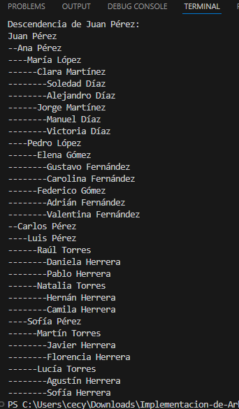
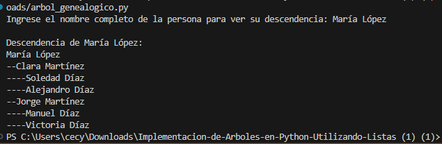
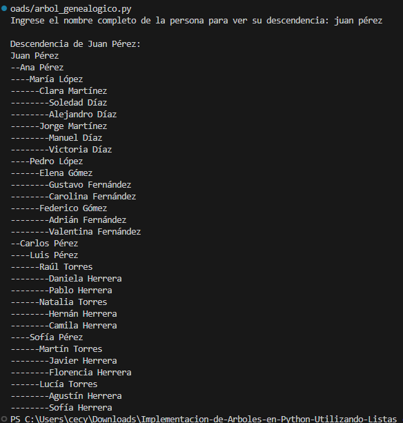
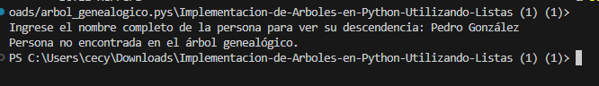

Enlace a Youtube : [https://www.youtube.com/watch?v=wj_eVhKD2sM](https://youtu.be/2mcV0GgSo7Q](https://youtu.be/2mcV0GgSo7Q)

# Implementación de un Árbol Genealógico en Python

Este repositorio contiene el trabajo práctico de la materia **Programación I** titulado **"Implementación de un Árbol Genealógico en Python: Aplicación de Estructuras de Datos Jerárquicas"**.

## Autores
- Diana Cecilia Den Dauw - ceciliadendauw@gmail.com
- Alexis Da Silva - alexis.da.silva.571@gmail.com

## Profesor/a
- Ariel Enferrel

## Fecha de entrega
- 09/06/2025

---

## Índice

1. [Introducción](#1-introducción)
2. [Marco Teórico](#2-marco-teórico)
3. [Caso Práctico](#3-caso-práctico)
4. [Metodología Utilizada](#4-metodología-utilizada)
5. [Resultados Obtenidos](#5-resultados-obtenidos)
6. [Conclusiones](#6-conclusiones)
7. [Bibliografía](#7-bibliografía)
8. [Anexos](#8-anexos)

---

## 1. Introducción

El presente trabajo integrador se centra en el desarrollo de un árbol genealógico implementado en Python. Este tema fue elegido debido a la relevancia que tienen las estructuras de datos jerárquicas en el ámbito de la programación y su aplicación en diferentes áreas, como la representación de relaciones familiares, organización de carpetas, árboles de decisión, entre otros.

En la programación, la correcta implementación de estructuras de árboles permite resolver problemas complejos de manera eficiente, gracias a su capacidad para modelar relaciones jerárquicas y representar datos de forma organizada y escalable. La utilización de árboles
facilita operaciones como búsquedas, recorridos y manipulaciones de datos, resultando fundamental para el desarrollo de aplicaciones que requieran modelar estructuras de este tipo.

De esta manera, se pretende fortalecer las competencias en el uso de clases, listas y recursividad, integrando conceptos teóricos y prácticos que resultan fundamentales en la formación de programadores y en el desarrollo de aplicaciones reales que demanden el uso de estructuras jerárquicas.

---

## 2. Marco Teórico

Un árbol es una estructura de datos jerárquica que se compone de nodos conectados mediante relaciones de padre e hijo. El primer nodo de la estructura se denomina raíz, y a partir de él se ramifican los demás nodos. Cada nodo puede tener cero o más hijos, y aquellos sin hijos se llaman hojas.
Los árboles son ampliamente utilizados en informática para modelar estructuras como jerarquías de archivos, árboles genealógicos, expresiones matemáticas, entre otros.

Existen diferentes tipos de árboles, entre los cuales se destacan:

### Tipos de árboles:
- **Árbol general**: cada nodo puede tener múltiples hijos. (Implementado en este trabajo)
- **Árbol binario**: cada nodo puede tener como máximo dos hijos.
- **Árbol balanceado**: diferencia de altura entre subárboles no mayor a uno.
- **Árbol completo**: todos los niveles completos, excepto el último, llenado de izquierda a derecha.

### Jerarquía de un árbol genealógico:

Un árbol genealógico es un caso especial de árbol general que representa las relaciones familiares. Su estructura se organiza de la siguiente manera:

- **Raíz**: antepasado principal (Juan Pérez).
- **Niveles intermedios**: generaciones de descendientes.
- **Hojas**: descendientes más jóvenes sin hijos registrados.

---

## 3. Caso Práctico

### Breve descripción del problema a resolver
El problema consiste en modelar un árbol genealógico sencillo, utilizando Python, que permita representar las relaciones familiares a través de una estructura de nodos y aristas. El usuario debe poder ingresar el nombre completo de una persona y, al encontrarla en el árbol, el programa debe mostrar toda su descendencia de manera jerárquica y ordenada. Esto permite visualizar las relaciones de parentesco de forma clara y accesible.

### Explicación de decisiones de diseño
Elegimos implementar el árbol genealógico utilizando clases y listas en Python debido a la facilidad de representación de relaciones jerárquicas. Se decidió usar búsqueda en profundidad (DFS) por su simplicidad y porque permite recorrer el árbol de forma natural para localizar a una persona y luego imprimir toda su descendencia. Además, la indentación en la impresión se implementó de manera recursiva, con el uso de guiones para representar
visualmente los niveles del árbol.

No fue necesario usar estructuras de datos más complejas ni algoritmos de ordenamiento, ya que el árbol está definido de forma fija y cada nodo tiene exactamente dos hijos. Esto simplifica el código y permite al usuario concentrarse en el concepto de árbol genealógico.

### Validación del funcionamiento
Se realizaron pruebas para:
- Buscar a la persona raíz (Juan Pérez) y comprobar que se imprime toda la descendencia.
- Buscar a personas en niveles intermedios como "María López" y "Luis Pérez".
- Verificar búsquedas con diferentes combinaciones de mayúsculas y minúsculas (ej. “juan pérez”, “JUAN PÉREZ”).
- Intentar búsquedas de personas que no existen en el árbol (ej. “Pedro González”) para validar el mensaje de error.

En todos los casos, el programa funcionó correctamente, mostrando la descendencia o el mensaje de error correspondiente.

---

## 4. Metodología Utilizada

- **Investigación previa**: Se revisaron recursos y documentación oficial de Python, especialmente sobre el uso de clases, listas y recursividad, para comprender las mejores prácticas de implementación de estructuras de datos jerárquicas.
- **Diseño del árbol**: Se planificó la estructura del árbol asegurando que cada nivel estuviera completo, lo que permitió representar de manera sencilla un árbol de altura 5 con todos los nodos llenos (2 hijos por nodo). Se asignaron nombres realistas a cada nodo para simular relaciones familiares.

- **Codificación y pruebas**: Se desarrolló el código en Python utilizando:
  - La definición de la clase Nodo para representar a cada persona.
  - Funciones recursivas para buscar personas y para imprimir la descendencia de
manera jerárquica.
  - Validación mediante casos de prueba con diferentes nombres para comprobar el
correcto funcionamiento del árbol.

### Herramientas utilizadas
- **IDE**: Visual Studio Code y Notepad++.
- **Lenguaje**: Python 3.x.
- **Control de versiones**: Git (opcional).
- **Terminal**: consola de comandos para pruebas.

### Trabajo colaborativo:  En caso de trabajo grupal (simulado en esta entrega), se distribuyeron las tareas de la siguiente manera:

- Un integrante investigó y recopiló la documentación necesaria. (Alexis)
- Otro se encargó del diseño del árbol y la planificación de los nombres.(Cecilia)
- Finalmente, otro integrante desarrolló y probó el código en Python, documentando las pruebas y validando los resultados.(Entre los dos)

---

## 5. Resultados Obtenidos
Con el desarrollo del caso práctico sobre el árbol genealógico en Python, se logró implementar de manera satisfactoria una estructura jerárquica que representa las relaciones de descendencia entre las diferentes generaciones de una familia ficticia. El programa permite al usuario ingresar el nombre completo de una persona y obtener en pantalla toda su descendencia, respetando la estructura jerárquica definida.

Entre los aspectos que funcionaron correctamente se destacan:
- La correcta construcción de un árbol de altura 5 con todos los nodos llenos, lo que permitió simular una genealogía realista y completa.
- La implementación de la búsqueda recursiva en profundidad (DFS) para localizar a la persona solicitada y mostrar su descendencia de manera jerárquica e indentada.
- La impresión clara y ordenada de la descendencia, utilizando una función recursiva que facilita la lectura y la comprensión del árbol.

Se realizaron diversos casos de prueba para validar el funcionamiento del programa, incluyendo:
- La búsqueda de personas ubicadas en diferentes niveles del árbol (desde la raíz hasta las hojas).
-  La validación de nombres inexistentes para comprobar que el programa responda adecuadamente con un mensaje de error.
- Pruebas con diferentes combinaciones de mayúsculas y minúsculas para verificar que la búsqueda no sea sensible al uso de letras capitales.

---

## 6. Conclusiones

Durante el desarrollo de este trabajo se consolidaron conocimientos sobre árboles jerárquicos en Python y se aplicó la recursividad para representar un árbol genealógico. Se comprendió la importancia de las estructuras de datos para modelar relaciones familiares y otras jerarquías en programación.

Este tema es útil para múltiples aplicaciones, como organización de sistemas de archivos y árboles de decisión. Entre las posibles mejoras, se podrían incluir funciones de búsqueda de ancestros, exportación gráfica y una interfaz más interactiva.

Una dificultad encontrada fue mantener la estructura equilibrada en cada nivel, lo que se resolvió mediante una planificación ordenada y la asignación clara de hijos a cada nodo. En definitiva, este trabajo reforzó las bases de programación y la aplicación práctica de árboles en problemas reales.

---

## 7. Bibliografía

- Python Software Foundation. (2024). [Python 3 Documentation](https://docs.python.org/3/) (acceso: 09/06/2025).
- Sweigart, A. (2019). *Automate the Boring Stuff with Python*. No Starch Press.
- McKinney, W. (2018). *Python for Data Analysis*. O'Reilly Media.
- Cormen, T. H., Leiserson, C. E., Rivest, R. L., & Stein, C. (2009). *Introduction to Algorithms* (3ra ed.). MIT Press.
- Universidad Nacional del Litoral. (s.f.). Material de apoyo de Programación I.

---

## 8. Anexos

- Capturas del programa funcionando ( Validación de funcionamiento item 3)
  - Comprobar que se imprime toda la descendencia:
  
  - Buscar a personas en niveles intermedios:
  
  - Verificar búsquedas con diferentes combinaciones de mayúsculas y minúsculas:
  
  - Intentar búsquedas de personas que no existen en el árbol:
  
